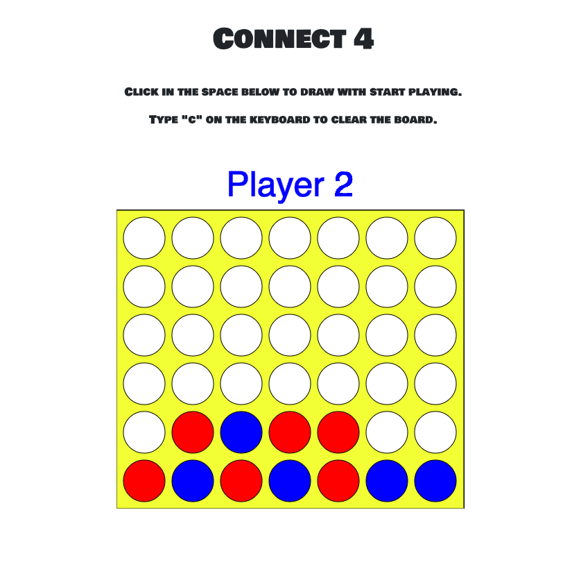

# connect4-angular

- This is the Angular version of my Connect 4 project.
- Check out the Electron version of this project [here](https://connect4-angular.firebaseapp.com).
- This project uses [P5JS](https://p5js.org/) to render a Connect 4 board.
- The original P5JS sketch that I used [can be found here](https://www.openprocessing.org/sketch/153535/).
- This project is also hosted on Firebase [here](https://connect4-angular.firebaseapp.com/).
- To build this project use the Angular CLI and run `npm run build`.
- To run this project locally use the Angular CLI and run `npm run start`.
